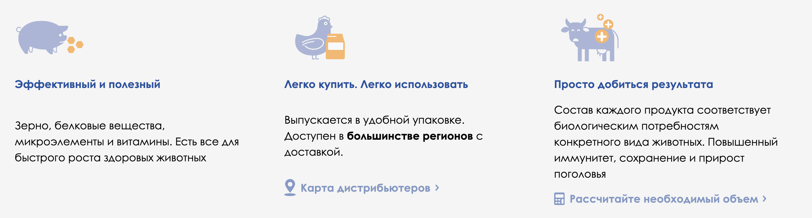
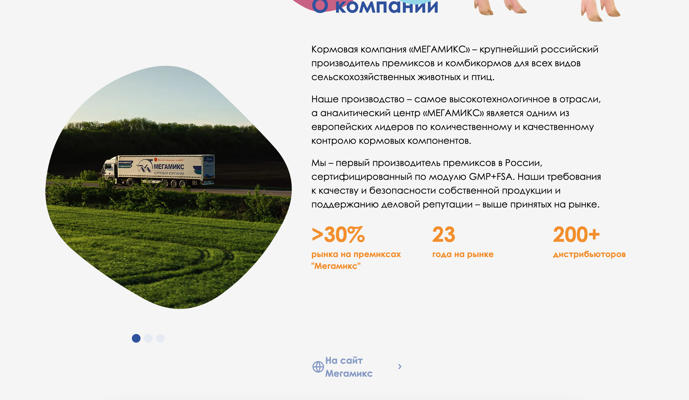
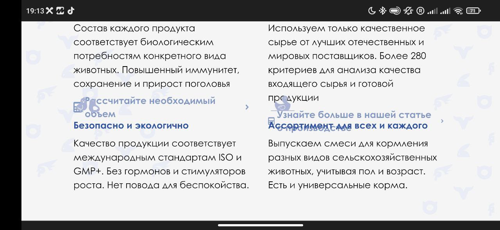

# MegaKorm - Thinkopp Test Task

Тестовое задание на позицию **"Web-программист | HTML-верстальщик"**

**Было выполнено:**

- [X] Тестирование сайта на различных устройствах:
  - macOS Safari 
  - macOS Chrome
  - IOS Safari
  - Android Chrome
- [X] Выявлены ключевые недостатки


**В работе:**

- [ ] Сформировать предложения по оптимизации
- [ ] Реализовать предложения по оптимизации


<a href="https://mordvintsevmv.github.io/megakorm" target="_blank">Страница (в разработке)</a>

---

## <a name="content">Содержание</a>

0. [Задание](#task)
    - [Вводная часть](#task-description)
    - [Программа «минимум»](#task-min)
    - [Программа «максимум»](#task-max)
    - [Сроки](#task-date)
1. [Тестирование](#testing)
   - [Safari - macOS (1440x900)](#testing-macos-safari)
   - [Chrome - macOS (1440x900)](#testing-macos-chrome)
   - [Safari - Iphone SE (640 х 1136) - вертикально](#testing-iphone-safari-v)
   - [Safari - Iphone SE (1136 х 640) - горизонтально](#testing-iphone-safari-h)
   - [Chrome - Redmi Note 9 (1080 х 2340) - вертикально](#testing-android-chrome-v)
   - [Chrome - Redmi Note 9 (2340 x 1080) - горизонтально](#testing-android-chrome-h)
2. [Ключевые недостатки](#main-problems)
3. [Предложения по оптимизации и улучшению](#advice)
4. [Реализация](#implementing)
3. [Контакты](#contacts)

---

## <a name="task">Задание</a>

### <a name="task-description">Вводная часть</a>

Есть сайт https://megakorm.ru/. 
Он должен быть адаптивным и при изменении размеров окна на десктоп версии или смене ориентации с вертикальной на горизонтальную версию – все может «плыть», сетка может сбиваться. 
Основная сложность в позиционировании анимированных SVG-блобов, которые могут съезжать или теряться на некоторых мобильных устройствах. 
Размер шрифтов в разных блоках меняется по-разному, как и высота контейнеров каждой секции и величина элементов. 
Сайт очень сырой с точки зрения верстки.

### <a name="task-min">Программа «минимум»</a>

1. Протестировать отображение сайта на различных устройствах. В т.ч. на мобильных (Apple, android) браузерах 
2. Выявить ключевые недостатки по созданию структуры сайта 
3. Сформировать короткие предложения по его оптимизации для увеличения быстродействия и улучшения верстки.


### <a name="task-max">Программа «максимум»</a>

1. Переписать верстку сайта сохранив анимацию Svg-блобов.
2. Сделать его адаптивным и рабочим на большинстве типов современных устройств.


### <a name="task-date">Сроки</a>

**Начало:** 1 февраля 2023

**Конец:** --

**Выполнить до:** 5 февраля 2023

[🔝Содержание🔝](#content)

---

## <a name="testing">Тестирование</a>

### <a name="testing-macos-safari">Safari - macOS (1440x900)</a>

#### Логотип (во вкладке)

Очень маленький текст, логотип не понятен:


#### Header

Дёргается анимация хрюшки при проведении мышкой:


При нажатии на кнопку "наши корма" пролистывает ниже элемента, верхние части svg-блоба и кнопки пагинации обрезаются:


#### Наши корма

Анимация блоба оставляет след:


Кнопка налезает на текст:


#### Таблица 

Текст из столбцов вылезает за пределы + неудобно читать без разделения столбцов


Кнопка закрытия очень бледная:


#### Почему стоит выбрать «Мегакорм»

Анимации оставляют след:


Неверная иконка для "узнайте больше в нашей статье о производстве" - стоит калькулятор:


#### Калькулятор

Кнопка налезает на текст:


Разметка может полностью сбиться при нажатии некоторых кнопок:


Одинаковый шрифт на разных блобах (больше блоб - больше текст) + "о компании" сливается с фоном:


Ввод количества животных в калькуляторе никак не выделяется от общего текста. Невозможно понять, что есть возможность вводить свои данные:


#### О Компании

Присутствует пустой блок с пагинацией:


У текста ссылки маленькие отступы слева + лучше растянуть текст в длину, а не в две строчки:


#### Клиентам

Имя и Фамилия сливаются с фоном + нет возможности скопировать email:


При перелистывании страницы карточка сотрудника не влезает + описание накладывается на фото (если оно большое)


#### Связаться

Неудобная валидация email (только после попытки отправки) 

Нет общего стиля: 

- Ошибка в email - всплывающее окно; 

- Не стоит галочка на обработке данных - выделяется красным.

Нельзя открыть согласие об обработке данных


Валидацию проходит email без .ru .com и тд


#### Наши дистрибьюторы

Заголовок сильно сливается с фоном:


Лишняя кнопка "назад"


"Выберите регион" написано в две строки:


Лупа выходит за рамки:


#### Полезные материалы

Анимации оставляют след:


Слишком маленькая дата + слишком бледная:


При пролистывании вправо карточки не влезают сверху и снизу:


#### Footer

Нет email по нажатию:


**Общие замечания:**
- Долгие прогрузки картинок
- Неплавные анимации

---

### <a name="testing-macos-chrome">Chrome - macOS (1440x900)</a>

Аналогичные проблемы, как в браузере Safari. 
Из улучшений:

Анимации не оставляют след:



Пагинация в разделе "О компании" показывает картинки:



---

### <a name="testing-iphone-safari-v">Safari - Iphone SE (640 х 1136) - вертикально</a>

#### Menu

По нажатию кнопки "Меню" само меню открывается/закрывается не с первого раза. 
При этом значок Меню не всегда соответствует состоянию открыто/закрыто:


#### Main

Пагинация с блока "Наши корма" находится слишком близко к главному блоку.
Создаётся впечатление, что пагинация предназначена для главного блока:


#### Наши корма

Часть блобов находится поверх текста и кнопок, а другая часть блобов находится снизу:


1. Блоб налезает на заголовок
2. Заголовок блока "Почему..." не имеет отступа от предыдущего блока


#### Таблица

Текст налезает друг на друга:


#### Почему стоит выбрать «Мегакорм»

1. Анимации оставляют след
2. Блоки находятся слишком близко друг к другу. Сложно опрределить, к какому блоку принадлежит ссылка.


#### Калькулятор

Блобы смещены от центра иконки животного:


Текст из блобов вылезает за границы:


У некоторых страниц блобы уменьшаются до минимального размера или обрезаются (текст исчезает на белом фоне):


#### О Компании

Слищком большой отступ от заголовка:


Отсутствуют элементы пагинации:


#### Клиентам

Слишком маленький текст / Слишком большой блов с фото:


#### Связаться

Блок не адаптивен. Слишком маленький текст и неудобные формы для мобильных девайсов:


#### Наши дистрибьюторы

Аналогичные проблемы (смещена лупа, лишняя стрелка назад и тд):


#### Полезные материалы

Отсутствует отступ от заголовка:


1. Блоб обрезается
2. Слишком большой блоб
3. Слишком большой отступ от блоба
4. Слишком маленькая дата


---

### <a name="testing-iphone-safari-h">Safari - Iphone SE (1136 х 640) - горизонтально</a>

#### Меню

Меню не всегда открывается:


#### Наш продукт

Вёрстка полностью слетает:


#### Калькулятор

1. Кнопки смещены и находятся под текстом
2. Блобы больше кнопок по размеру
3. Блобы не попадают под выбранный элемент


#### О компании

Слишком большие отступы:


Отсутствуют элементы пагинации:


#### Наши дистрибьюторы

Аналогичные проблемы (смещена лупа, лишняя стрелка назад и тд):


#### Footer

Слишком большие ссылки:


---

### <a name="testing-android-chrome-v">Chrome - Redmi Note 9 (1080 х 2340) - вертикально</a>

#### Menu

Меню может не открываться / значок не всегда соответствует состоянию меню:


#### Наши корма

Кнопки и текст иногда находятся за блобом:


#### Таблица

Текст сливается:


#### Почему стоит выбрать «Мегакорм»

Блоки слипаются друг с другом:


#### Калькулятор

Для некоторых элементов блоб уменьшается до минимума / текст не видно:


#### О Компании

Преимущества (оранжевый текст) слишком большой:


#### Связаться

1. Блок "связаться" не адаптивен
2. Текст слишком маленький


#### Наши дистрибьюторы

Аналогичные проблемы (смещена лупа, лишняя стрелка назад и тд):


---

### <a name="testing-android-chrome-h">Chrome - Redmi Note 9 (2340 x 1080) - горизонтально</a>

Вёрстка полностью слетает:

#### Header


#### Наши корма


#### Почему стоит выбрать «Мегакорм»




#### О Компании


#### Клиентам


#### Наши дистрибьюторы


#### Footer


---

## <a name="main-problems">Ключевые недостатки</a>


**Общие недостатки:**

1. Маленький логотип для вкладки браузера;
2. Неплавные анимации из-за большой нагрузки;
3. При нажатии кнопок меню страница пролистывается ниже/выше, чем надо;
4. Кнопки влево/вправо налезают на текст или пропадают под блобом (по всему сайту);
5. Колонки в таблице налезают друг на друга / вылезают за границы;
6. Кнопка закрытия таблицы слишком бледная;
7. В блоке "Почему стоит выбрать «Мегакорм»" Неверная иконка для "узнайте больше в нашей статье о производстве" - стоит калькулятор;
8. В блоке "Калькулятор" кнопки с животными налезают на текст;
9. В блоке "Калькулятор" блобы не всегда находятся в области выбранного элемента (зависит от выбранного элемента);
10. В блоке "Калькулятор" вёрстка сбивается при выборе некоторых животных;
11. Ввод количества животных в калькуляторе никак не выделяется от общего текста. Невозможно понять, что есть возможность вводить свои данные.
12. Текст в блобах не соответствует размеру блоба (больше блоб - больше текст) (блок "Калькулятор" и другие);
13. В блоке "О Компании" у ссылки "На сайт Мегамикс" маленькие отступы слева;
14. В блоке "О Компании" у ссылки "На сайт Мегамикс" текст написан в две строки;
15. В блоке "Клиентам" для десктопной версии Имя и Фамилия находятся на блобе (сливаются с фоном);
16. В блоке "Клиентам" обрезаются карточки с людьми при пролистывании;
17. В блоке "Клиентам" невозможно скопировать email;
18. В блоке "Связаться" нет общего стиля:
    - Ошибка в email - всплывающее окно; 
    - Не стоит галочка на обработке данных - выделяется красным.
19. В блоке "Связаться" не открывается согласие на обработку данных;
20. В блоке "Связаться" валидацию проходит email без .ru, .com и тд;
21. В блоке "Наши дистрибьюторы" лишняя кнопка "назад";
22. В блоке "Наши дистрибьюторы" заголовок сливается с фоном + написан в две строки;
23. В блоке "Наши дистрибьюторы" в окне выбора региона смещена лупа;
24. В блоке "Наши дистрибьюторы" в окне выбора региона текст "Выберите регион" написан в две строки;
25. В блоке "Полезные материалы" разные отступы между картинкой и заголовком статьи;
26. В блоке "Полезные материалы" слишком маленькая и бледная дата у статьи;
27. В блоке "Полезные материалы" при пролистывании карточки со статьями обрезаются справа и снизу;
28. В блоке "Footer" нет email в соответствующей кнопке.


**Недостатки в Safari:**

1. Анимации оставляют след;
2. Отсутствует блок с картинками в разделе "О Компании".


**Мобильная версия:**

1. По нажатию кнопки "Меню" само меню открывается/закрывается не с первого раза;
2. Значок Меню не всегда соответствует состоянию открыто/закрыто;
3. Проблемы с отступами между разделами - некоторые блоки слипаются / некоторые блоки имеют слишком большие отступы;
4. В блоке "Наши Корма" некоторые блобы находятся сзади текста, а некоторые поверх;
5. Заголовки в таблице слипаются друг с другом;
6. В разделе "Почему стоит выбрать «Мегакорм»" между пунктами слишком маленькие отступы;
7. В блоке "Калькулятор" блобы могут обрезаться;
8. В блоке "Калькулятор" при выборе некоторых животных блоб может уменьшаться до минимального размера - текст перестает быть видимым;
9. В блоке "Клиентам" слишком большое фото / слишком маленький текст;
10. Блок "Связаться" полностью не адаптивен;
11. При переходе в горизонтальный режим разметка может полностью ломаться.


**Орфографические ошибки:**
1. (512 строка index.html) 
    - __"макро и -микроэлементы"__ - ошибка
    - **"макро- и микроэлементы"** - правильно
2. (626 строка index.html)
    - __"дистрибьютеров"__ - ошибка
    - **"дистрибьюторов"** - правильно
3. (844 строка index.html)
    - __"chiken"__ - ошибка
    - **"chicken"** - правильно

и т.д.


**Недостатки в коде:**
1. Отсутствие комментариев

**Дополнительно:**

При изучении кода был найден скрытый блок с классом "cattleModal". 
Судя по скриптам, он должен открываться по нажатию кнопки в блоке "Калькулятор". 
На данный момент так и не удалось найти необходимую кнопку.

---

## <a name="advice">Предложения по оптимизации</a>

**Общие исправления:**
1. (По желанию) Изменить логотип для вкладки на более крупный (например, использовать только жирную букву М);
2. Исправить орфографические ошибки;
3. Добавить регулярное выражение для валидации email:

```html
<input type="email" ... pattern="[a-z0-9._%+-]+@[a-z0-9.-]+\.[a-z]{2,}$">

```
4. Заменить иконки:
    - Кнопка закрытия - на более светлую;
    - Иконка калькулятора в блоке "Почему..." у "Гарантия качества" на иконку статьи

5. В Калькуляторе выделить строку для ввода количества животных (например, подчеркнуть, выделить другим цветом, добавить подпись "введите данные" и т.д.);
6. Исправить отступы у различённых элементов:
    - Сделать одинаковые отступы сверху и снизу для всех заголовков;
    - Поправить отступы текста от значков;
7. Починить ссылки:
    - Добавить email в footer;
    - Добавить ссылку на "согласие об обработке..." в блоке "Связаться"
8. Поправить элементы пагинации, чтобы они не обрезались при перелистывании.
9. Много исправлений по стилям:
    - Проверка наложения элементов друг на друга (кнопки могут находиться на тексте или под блобом и т.д.);
    - Смещение некоторых элементов (например, лупа в поиске региона);
    - Привести все шрифты и отступы к стандартам (одинаковые для всех схожих элементов)

10. полное переделывание мобильной версии сайта.


**Проблема с анимацией на Safari (блок "Почему стоит выбрать «Мегакорм»") + проблема с отображением некоторых элементов с картинками:**

На сайте используются файлы формата webp с анимацией (и без). 
Браузеры Safari на macOS и ios имеют проблемы с его поддержкой.
На старых версиях браузера (примерно до 2020 года) поддержка формата полностью отсутствует, а на новых версиях наблюдаются проблемы с анимацией.
Поэтому есть несколько вариантов:
1. Для браузера Safari использовать статичный PNG;
2. Использовать GIF или другие способы анимации.

**Проблема с оптимизацией:**
 
Вероятнее всего главной причиной "подтормаживаний" сайта и его долгой прогрузки являются анимации блобов.
Каждый блоб представляет собой svg-изображение и анимируется отдельно. Пример:

```html
<svg version="1.1" xmlns="http://www.w3.org/2000/svg" viewBox="0 0 500 500" width="5%" id="blobSvg" style="opacity: 1;">
            <image x="0" y="0" width="100%" height="100%" clip-path="url(#shapeM)" href="images/mailImg.png" preserveAspectRatio="none"/>
            <defs>
                <lineargradient id="gradient" x1="0%" y1="0%" x2="0%" y2="100%">
                    <stop offset="0%" style="stop-color: rgb(238, 205, 163);"/>
                    <stop offset="100%" style="stop-color: rgb(239, 98, 159);"/>
                </lineargradient>
            </defs>
            <clippath id="shapeM">
                <path id="blob" fill="url(#gradient)" d="M 445.549 320.306 Q 417.612 390.612 354.917 440.364 Q 292.223 490.116 225.223 449.335 Q 158.223 408.554 101.525 366.612 Q 44.8258 324.67 43.3458 249.442 Q 41.8658 174.214 98.1271 129.19 Q 154.388 84.1652 219.888 67.4174 Q 285.388 50.6697 335.5 93.529 Q 385.612 136.388 429.549 193.194 Q 473.486 250 445.549 320.306 Z">
                    <animate attributeName="d" dur="10000ms" repeatCount="indefinite" values="M440.5,320.5Q418,391,355.5,442.5Q293,494,226,450.5Q159,407,99,367Q39,327,31.5,247.5Q24,168,89,125.5Q154,83,219.5,68Q285,53,335.5,94.5Q386,136,424.5,193Q463,250,440.5,320.5Z;M453.78747,319.98894Q416.97789,389.97789,353.96683,436.87838Q290.95577,483.77887,223.95577,447.43366Q156.95577,411.08845,105.64373,365.97789Q54.33169,320.86732,62.67444,252.61056Q71.01719,184.3538,113.01965,135.21007Q155.02211,86.06634,220.52211,66.46683Q286.02211,46.86732,335.5,91.94472Q384.97789,137.02211,437.78747,193.51106Q490.59704,250,453.78747,319.98894Z;M411.39826,313.90633Q402.59677,377.81265,342.92059,407.63957Q283.24442,437.46649,215.13648,432.5428Q147.02853,427.61911,82.23325,380.9572Q17.43796,334.29529,20.45223,250.83809Q23.46649,167.38089,82.5856,115.05707Q141.70471,62.73325,212.19045,63.73015Q282.67618,64.72705,352.67308,84.79839Q422.66998,104.86972,421.43486,177.43486Q420.19974,250,411.39826,313.90633Z;M440.5,320.5Q418,391,355.5,442.5Q293,494,226,450.5Q159,407,99,367Q39,327,31.5,247.5Q24,168,89,125.5Q154,83,219.5,68Q285,53,335.5,94.5Q386,136,424.5,193Q463,250,440.5,320.5Z;">
                    </animate>
                </path>
            </clippath>
        </svg>
```

На сайте присутствует более 20 блобов, которые анимируются по отдельности. При удалении анимации из кода сайт стал загружаться быстрее и работать более плавно.

Для решения данной проблемы есть несколько вариантов:
1. Оставить анимацию svg только для самых важных элементов;
2. Перейти с svg-анимации на css-анимацию:
   - удалить все svg-блобы;
   - создать класс .blob;
   - задать для него необходимую высоту и ширину;
   - задать анимацию изменения border-radius с помощью keyframes:

```css
.blob{
   height: 100px;
   width: 100px;
   
   animation: animate 10s linear infinite;
}

@keyframes animate {
   0%,100%
   {
      border-radius: 64% 36% 27% 73% / 55% 58% 42% 45%;
   }
   
   25%
   {
      border-radius: 28% 72% 44% 56% / 49% 40% 60% 51%;
   }
   ...
}
```

   - Создавать блоки div с классом .blob, где необходимо разместить блоб

3. Использовать уже оптимизированные библиотеки с готовыми svg-блобами.

---

## <a name="implementing">Реализация</a>

**В работе**

---

## <a name="contacts">Контакты</a>

**TG**: [@mordvintsevmv](https://t.me/mordvintsevmv)

**e-mail**: mordvintsevmv@gmail.com


[🔝Содержание🔝](#content)